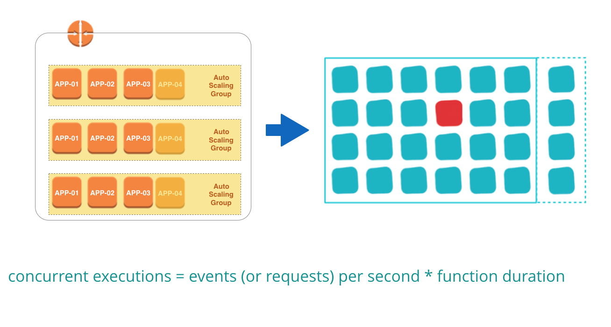
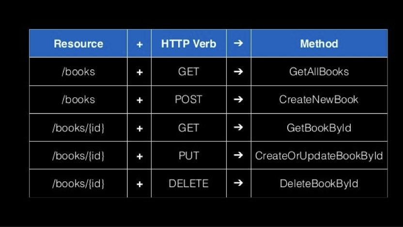

<!-- page_number: true -->
# Serverless 101

## Welcome to the world of functions & BaaS

---

# Serverless?

# No servers?

# Zero infrastructure?

---

# Not having to think about servers!

---

# The evolution of IT infrastructure

---

## In the beginning there were physical servers...

---

## Problems of infrastructure handling in the dark age

* Compute resources acquirement was hard and tedious
* Inflexible compute resources cannot meet the demand of ever-changing business needs
* Inflexible compute resources hinder value creation and innovation

---

## Let there be cloud

---

## Traditional Cloud Models

---

## Evolution of IT infrastructure

---

## Benefits of cloud

* ***Convenient and timely*** access to compute resource empowers faster value delivery and innovation
* ***Flexible and scalable*** compute resources embraces rapid growth in business needs
* ***Better utilized*** compute resource usage reduces cost

---

---

## Beyond traditional cloud...

* If ***better utilization of compute resources*** reduces cost, can we push  utilization to the extreme?
* If ***better scalability meets rapid-changing business needs***, can we make software ***scalable by default***?
* If ***more of delivering business value and less of system administration*** are desirable, can we further reduce the burden of system administration operations?

---

## Here comes FaaS & Serverless

---

## But serverless is more than FaaS

Continue on..

---

# First glance at Serverless

---

1. **Functions are triggered by upstream events** (message from message queue, user clicking a button, etc.).
    Both push and pull model can be used for fetching events.
2. **Functions run in stateless transient containers**.
    Containers are created on demand and destroyed as soon as function execution finishes.
3. **Functions are fully managed by cloud service provider**.
    Usual operation concerns on monitoring, logging, security patching, etc. are also offloaded to 3rd party cloud  providers.

---

## What about the database and these "Business services"?

---

* Functions act as ***"glues" to different business services***
* Business services include authentication services (Auth0, AWS Cognito), Monitoring (CloudWatch), Data source & analytic service (AWS Kinesis), etc.
  These are sometimes referred to as ***Backend as a Service (BaaS)***.
* Database => cloud accessible ***Database as a Service (DBaaS)***, e.g. AWS Dynamodb, Firebase

---

## Serverless == No servers?

---

## Serverless == No server administration!

Stateless transient functions & these ba run on servers fully managed by cloud platform provider. Delivery teams focus on development and deployment, thus zero server maintenance.

---

## In the dark age servers are treated as pets

---

## In the cloud age servers are treated as cattle

---

## In the serverless world 

---

## Serverless providers

---

# Serverless Architecture & Benefits

<small>*AWS is used as example, but most of the following apply to other cloud vendors</small>

---

## Serverless Benefits: only pay for compute time

---

## Serverless Benefits: easier operations & maintenance

Cloud providers like AWS provided integrated services like monitoring, logging management, auto-scaling, exceptions management, etc.

---

## Serverless Benefits: scalability by default

---

## Serverless Benefits: seamless integration with other cloud services

Lambda functions need to be bound to event sources (either custom event or AWS native services)

---

## AWS Lambda Programming model

* AWS SDK included in function runtime
* Environment variables can be dynamically injected at runtime

---

## Serverless architecture typical examples

<small>*Examples shamelessly taken from [Serverless Architectures](https://martinfowler.com/articles/serverless.html) by Mike Roberts</small>

---

## UI Driven application: traditional architecture

* traditional 3-tier client-oriented system with server-side logic
* logic-thin client, most logic including authentication, page navigation, searching, transactions implemented by the server application

---

## UI Driven application: serverless architecture

---

## Differences between traditional and serverless architecture

* custom developed authentication logic => replaced with 3rd party BaaS service
* DBaaS (e.g. AWS DynamoDB) allowed client direct access to subset of database
* client becomes business logic rich: keeping track of a user session, understanding the UX structure of the application (e.g. page navigation), reading from a database and translating that into a usable view, etc.
* Product search feature still reside within server-side, with a FaaS function responding to HTTP requests via API Gateway. Both client and server function read from the same product database.

---

## API Gateway

* fully managed service that makes it easy for developers to create, publish, maintain, monitor, and secure APIs at any scale.
* traffic management, authorization and access control, monitoring, and API version management

---

---

## Message Driven application: traditional architecture

* backend data-processing service
* user clicks on an ad redirect them to the target of the ad
* also posts a message to a channel that can be asynchronously processed by a ‘click processor’ application that updates a database, to charge the adertiser

---

## Message Driven application: serverless architecture

* much smaller difference
* long lived consumer application => replaced with a FaaS function
* vendor supplies the message broker (e.g. AWS SQS) and FaaS environment(e.g. AWS Lambda), closely integrated with each other

---

## Mixed architectures in reality

Charactistics:
* Lambda co-exist with microservices
* Smaller service units

Gains:

* EC2 instances cost reduced 30% 
* Less Infrastructure config
* More flexible tech stack choices

---

# Continuous Delivery with serverless

---

## CD pipeline with serverless

---

## Local Development & Testing

* Focus on event interface design of FaaS functions
* Easy unit testing & TDD
* For local integration testing, use [SAM local](https://github.com/awslabs/aws-sam-local) or [docker-lambda](https://github.com/lambci/docker-lambda) to simulate FaaS environment
* Use SAM Local to simulate API Gateway and generate event payload

---

## Deployment

* SAM to describe FaaS functions
* Cloudformation to deploy to AWS S3

---

## Environment management

* Versioning: Each function uploaded has unique version number (ARN) and it's immutable.
* Alias: Function can have alias, source can use alias to call functions

---

# Serverless limitations & future

---

## Serverless limitations

---

## AWS Supported runtime environments

* Node.js 4.3.2 and 6.10.3
* Java 8
* Python 3.6 and 2.7
* .NET Core (C#) 1.0.1

Scripting languages runtime startup time: several hundred milliseconds.
Java startup time can take as much as 10 secs.

---

## Vendor dependent & Vendor lock

* FaaS environment
* Configurable event sources and services integration

---

## Ecosystem still in its infancy

---

# Conclusion

---

* Serverless is superb in event based scenarios, with short development cycles and easy integration with event sources, zero server configuration result in improved delivery efficiency.
* Limitations apply. Single FaaS function cannot be too complex and hardly suitable for every scenario.
* Future is likely to be mixed solution of serverless & container-based systems.

---

# Thanks!

Any questions/issues please let me know at:

https://github.com/richardzone/ansible-training-workshop/issues

Presented with ♥ by Richard Liu